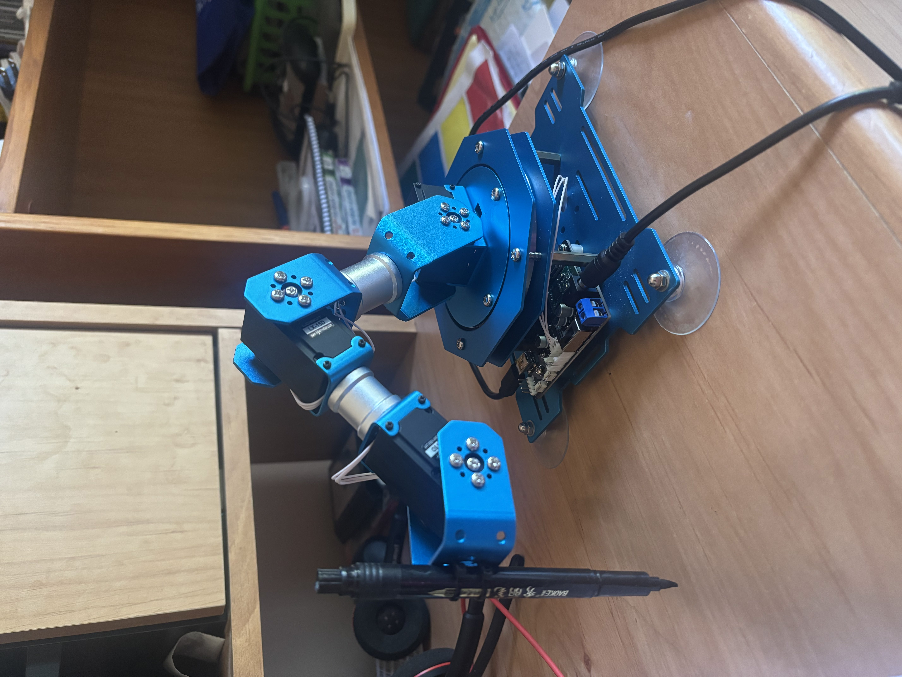
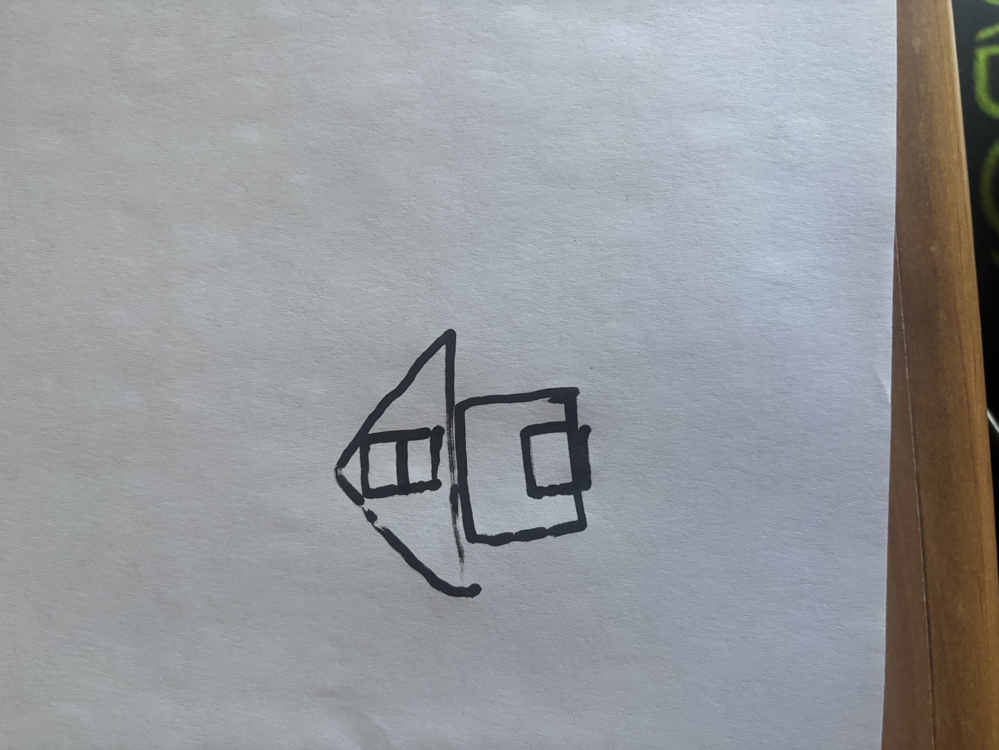

# Drawing with the HiWonder XArm 1S

### A 4-DOF Robotic Arm That Draws What You Tell It



---

## 🛠️ Overview

This project transforms a HiWonder XArm 1S robotic arm into a drawing machine. 
With a pen mounted at the wrist, the arm follows a 3D path defined in Cartesian space. 
Using analytical forward and inverse kinematics, the arm calculates and executes the servo angles 
required to place the pen precisely on a flat surface.

---

## 🔧 Hardware Used

* HiWonder XArm 1S (4 DOF version)
* USB connection to a host computer
* Pen holder (a couple of zip ties)
* Power supply (5–7.4V recommended)
* Drawing surface (paper or whiteboard)
* Tape/something to clamp the drawing surface down to the ground

---

## 🧠 What It Does

* Implements forward kinematics using homogeneous transformation matrices
* Uses inverse kinematics to calculate joint angles for any reachable (x, y, z) target
* Keeps the pen tip vertical using wrist angle compensation
* Executes drawing paths point by point

---

## 🧮 Forward Kinematics

The function below computes the pen-tip position from 4 joint angles:

```python
def fk_4dof(t1_deg, t2_deg, t3_deg):
    t1 = np.radians(t1_deg)
    t2 = np.radians(90.0 - t2_deg)  # 0° up, 90° forward
    t3 = np.radians(t3_deg)  # positive bends down
    t4 = np.radians(90-t2_deg+t3_deg)

    T = (
        Rz(t1) @ Tz(L1) @
        Ry(-t2) @ Tx(L2) @
        Ry(-t3) @ Tx(L3) @
        Ry(t4) @ Tx(PX) @
        Tz(-PZ)
    )

    return (T @ np.array([0, 0, 0, 1]))[:3]
```

This produces a homogeneous transformation matrix from base to pen tip.

We define:

* `t2 = radians(90 - theta2)` (shoulder 0° = straight up)
* `t3 = radians(theta3)` (elbow positive = bend down)
* `t4 = radians(theta4)` (wrist compensation)

---

## 🤖 Inverse Kinematics

Given a 3D point (x, y, z), we calculate joint angles as follows:

```python
def ik_4dof(x, y, z, theta4_override=None):
    # For all intents and purposes, we only need the elbow up solution
    # since its just drawing. Thus, only calculate the elbow up solution

    def wrap_angle(theta):
        return (theta + 180) % 360 - 180

    theta1 = math.degrees(math.atan2(y, x))
    r_tip  = math.hypot(x, y)
    r_w    = r_tip - PX
    z_w    = z + PZ
    dz     = z_w - L1
    D2     = r_w**2 + dz**2

    if D2 > ((L2+L3)**2 + 1e-6) or D2 < ((L2-L3)**2 - 1e-6):
        raise ValueError("unreachable")

    cos_m3 = (D2 - L2**2 - L3**2) / (2*L2*L3)
    cos_m3 = np.clip(cos_m3, -1.0, 1.0)
    m3     = -math.acos(cos_m3)
    theta3 = math.degrees(m3)

    phi = math.atan2(dz, r_w)
    psi = math.atan2(L3*math.sin(m3), L2+L3*math.cos(m3))
    m2 = phi - psi
    theta2 = 90.0 - math.degrees(m2)

    theta4 = theta4_override if theta4_override is not None \
             else 90 - theta2 + theta3

    joint_angles = np.array([wrap_angle(theta1), wrap_angle(theta2), wrap_angle(theta3), wrap_angle(theta4)])

    for angle in joint_angles:
        if angle > 125 or angle < -125:
            raise ValueError("angle is outside range")

    return joint_angles
```

This gives of the two valid configurations, the elbow-down one.

---

## 🖋️ Drawing a Path

You can define a path as an array of 3D points, for example:

```python
path = [
    [6.0, 0.0, 1.0],
    [6.0, 0.25, 1.0],
    [6.0, 0.5, 1.0],
    ...,
    [6.0, 4.0, 1.0]
]
```

Each point is passed through `ik_4dof(...)` and sent to the XArm via USB.

---

## 🧪 Lessons Learned

* Homogeneous transforms made FK clean and modular
* Inverse kinematics can be done entirely analytically for a 4-DOF chain
* Clamping `acos` inputs avoids domain errors due to floating-point precision
* Wrist angle correction is essential for consistent drawing

---

## 🚀 Try It Yourself

1. Clone the repo
2. Plug in your XArm and power it
3. Run the Python script:

   ```bash
   python house_demo.py
   ```

You can define your own path arrays and modify the script to draw letters, shapes, or even signatures.

---

## 📸 Demo

[Drawing Video](images/drawing_demo.mp4)


---

Made by Sachet Korada

[Back to Top](#drawing-with-the-hiwonder-xarm-1s)
